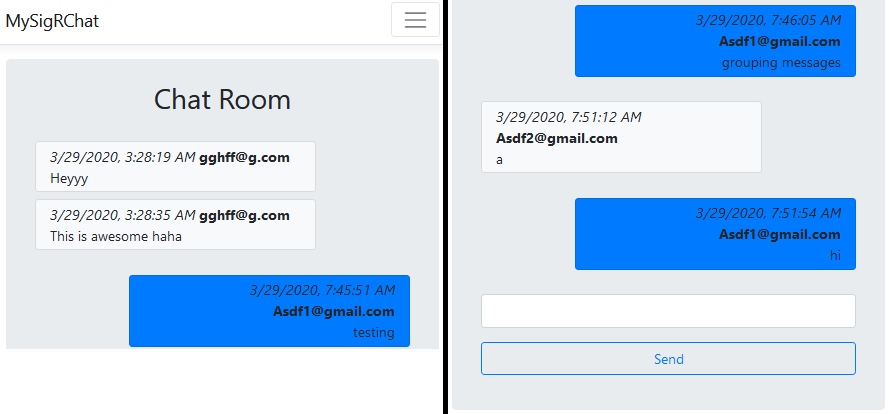

# SignalR Chat app
A simple real-time chat app. Created using ASP.NET Core with MVC/SignalR. This project is for learning purposes.  
**Note**: This app was hosted with Azure & AWS RDS with the free packages so the [live site][4] may not be active.  

I followed along a [video][1] to make a chat app; it didn't work and had many bugs. 
After spending some time debugging, making small changes and seeing what happens,
and looking at stackoverflow and Microsoft's MvcMovie tutorial project, I finally got a basic working chat app.

Other guides used: 
- [Azure: Quickstart: Create an ASP.NET Core web app in Azure][2]  
- [AWS RDS: Creating a Microsoft SQL Server DB Instance and Connecting to a DB Instance][3]  
  **Note:** RDS Error 258: Click on the **VPC** > **Security Groups** on the left > select associated security group > **Actions** > **Edit inbound rules** > add rule with **Type: MS SQL** and **Source: Anywhere**

Topics covered: configure SignalR, SignalR Hubs, SignalR client library, send messages from any client to all connected clients

Expansion ideas/to-do: remove/edit messages, email sender, use onclick instead of form submission

[1]: https://www.youtube.com/watch?v=RUZLIh4Vo20
[2]: https://docs.microsoft.com/en-us/azure/app-service/app-service-web-get-started-dotnet
[3]: https://docs.aws.amazon.com/AmazonRDS/latest/UserGuide/CHAP_GettingStarted.CreatingConnecting.SQLServer.html
[4]: https://sigrchat.azurewebsites.net/
